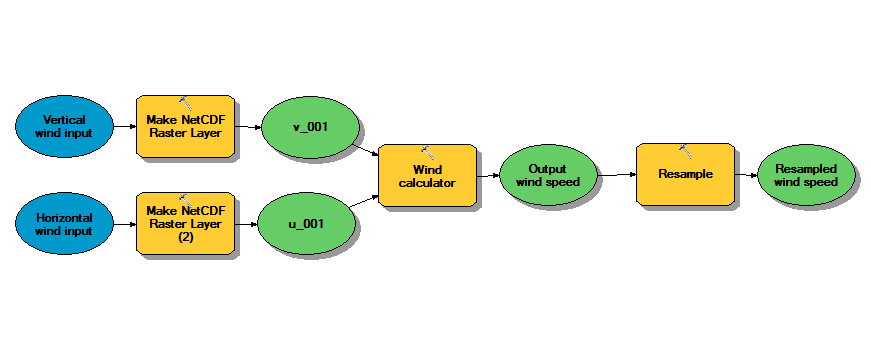
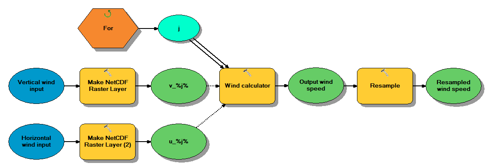
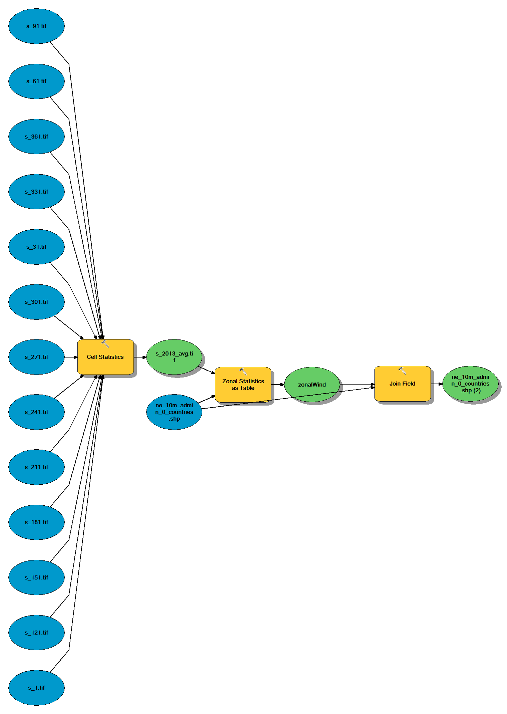
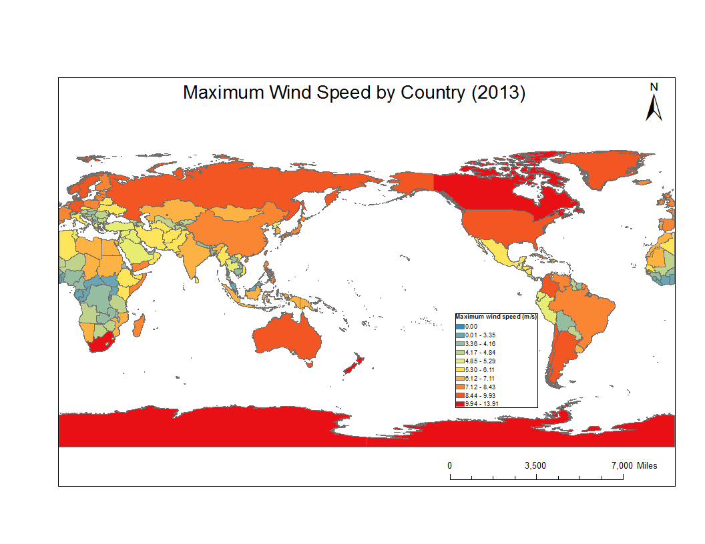

# Lab 1

## Basic Model

## Model with Iterator

## Summarizing Model

## Country Max Wind Production

## Summary of Top Countries

The top 3 countries by MAX wind speed were:

1. [Antarctica]
2. [Fr. S. Antarctic Lands]
3. [Heard I. and McDonald Is.]

The top 3 countries by MEAN wind speed were:

1. [Heard I. and McDonald Is.]
2. [Fr. S. Antarctic Lands]
3. [S. Geo. and S. Sandw. Is.]

